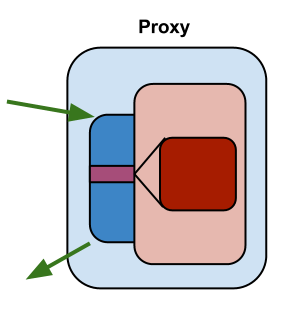
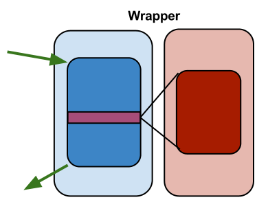
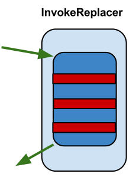

# Proxetta

**Proxetta** creates dynamic proxies in run-time, providing efficient\
support for aspects; using developer-friendly syntax.

A proxy class is a class that wraps or extends the target class specified at\
runtime. Proxy **Aspect** contains advice and pointcut rules for\
applying advice. Proxy **Advice** is the code portion of an aspect, i.e.\
the logic that replaces crosscutting concern. A **pointcut** is a set of\
points in the application where advice should be applied, i.e. which\
methods will be wrapped by proxy.

### Proxetta types

**Proxetta** offers 3 different proxy types, that we call: `Proxy`,\
`Wrapper`and `InvokeReplacer`.

#### Proxy 

`ProxyProxetta` is **Proxetta** that extends the target class (_light red_).\
Pointcut methods (_dark red_) are overridden in proxy subclass (_light blue_)\
and called when required from the advice (_dark blue_).

Therefore, instead of working with the target instance, we have proxified\
instance. It will be of the same type as the target (since it’s a\
subclass).

#### Wrapper 

`WrapperProxetta` is _Proxetta_ that creates a separate, wrapper class\
(_light blue_) from the target class (_light red_). The wrapper class holds the\
reference of the target class instance. Pointcut methods (_dark red_)\
are called from the wrapper advice methods (_dark blue_). But wrapper\
also delegates call to other target methods.

**Proxetta** offers furthermore several ways how the wrapper behave, and\
if it implements some interface.

#### InvokeReplacer 

Finally, `InvokeProxetta` is a bit different and unique type of proxy. It\
creates a clone class and replaces invocation of target methods in the\
method code with advised method invocation. In other words, it simply\
replaces method calls in the target class.

### Why Proxetta? 

First, **Proxetta** is developer-friendly - the syntax is clean and fluent, which makes everyday development easy.

However, what is unique is the way how pointcuts and advices are defined.

_Proxetta_ pointcuts are defined in pure Java, no custom proprietary\
notation is used. Therefore, any matching mechanism may be used: regular\
expression, wildcards; configuration might be stored in external (XML)\
files and so on.

**Proxetta's** advices uses a completely different concept than any other AOP\
library. Advices are written _in the same way_ as users would write real\
subclass. Instead of using a custom class for accessing proxified method\
and its arguments, they will be **replaced** directly on the usage\
place.

This unique approach makes **Proxetta** fast. Very fast.

The Invocation of replacements proxies is another unique feature of **Proxetta**.

#### Performance test 

Because of its unique approach for advices definition, _Proxetta_ is\
very fast. Compared to one of the most used code generation libraries,\
[CGLIB](http://cglib.sourceforge.net/), the invocation of proxified method is significantly faster.
